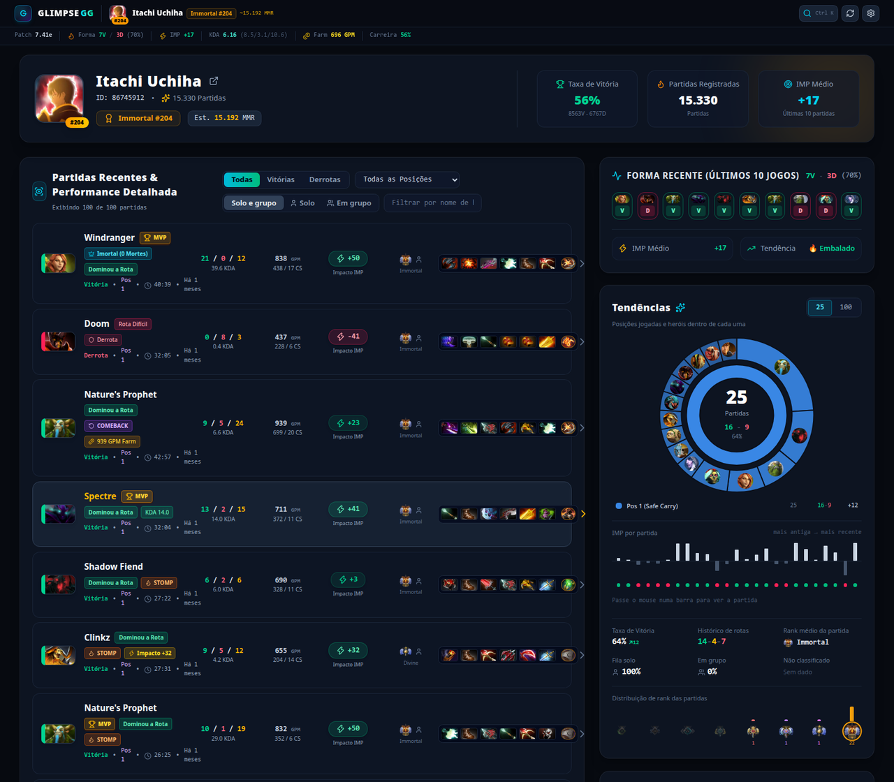
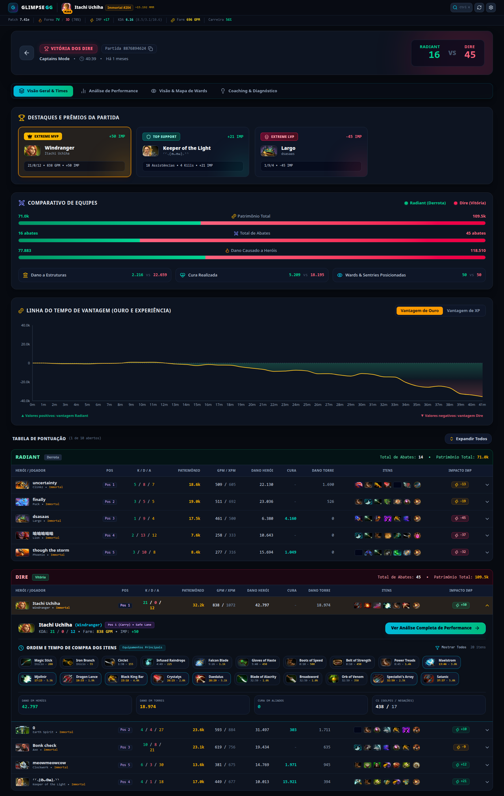
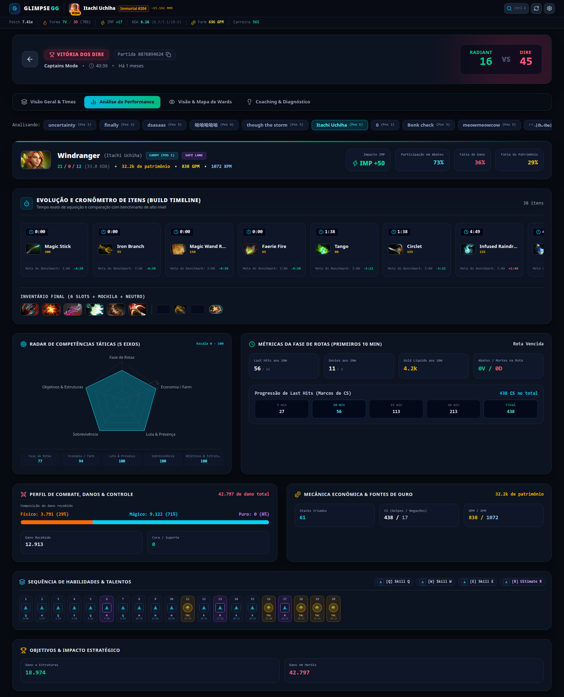
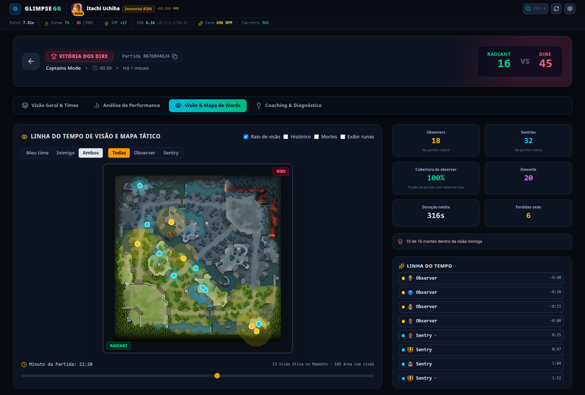
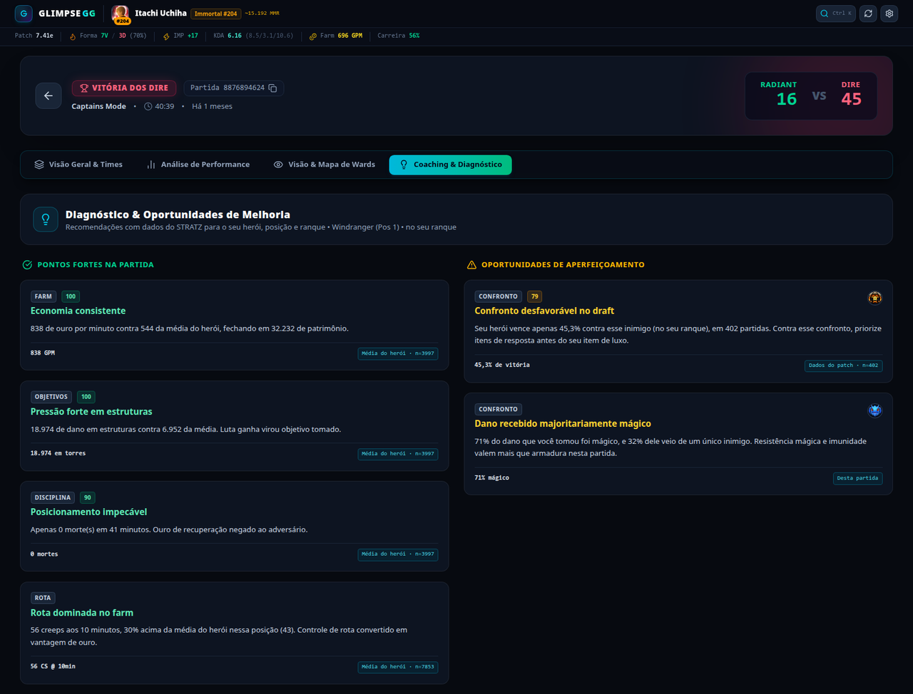
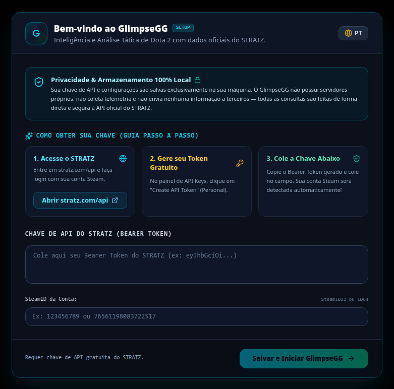

# GlimpseGG

Aplicativo desktop de análise pós-jogo de Dota 2. Cruza dados da STRATZ e da OpenDota para
transformar um replay já encerrado em leitura tática: benchmarks por herói e posição, timeline de
vantagem, mapa de visão e insights acionáveis por jogador.

Construído com Electron + React + TypeScript + Vite. Interface em português (pt-BR) e inglês (en-US).

## Por que existe

O GlimpseGG não tenta ser uma alternativa à STRATZ nem propor uma metodologia nova. O objetivo é
mais estreito: **manter atualizado o que a STRATZ mostrava**.

A STRATZ parou de receber atualizações, e o custo disso aparece a cada patch — heróis e itens novos
não entram nas bases, então partidas que os incluem ficam sem exibição correta e fora de qualquer
análise. Não é que a leitura fique pior: ela simplesmente não acontece para o conteúdo recente.

O GlimpseGG preenche essa lacuna. **O cálculo das métricas é o mesmo empregado pela STRATZ** — a
intenção não é divergir dos números que você já conhecia, e sim continuar produzindo-os para o
patch atual, com heróis e itens novos devidamente reconhecidos, exibidos e analisados.

## Recursos

**Dashboard do jogador**
- Perfil, rank e forma recente
- Lista de partidas com resumo por jogo
- Heróis mais jogados e tendência de performance
- Heatmap de atividade
- Matriz de duplas e tendências vindas da STRATZ

**Análise de partida** — quatro abas por jogador
- `OVERVIEW` — scoreboard, visão geral dos times, timeline de vantagem
- `PERFORMANCE` — métricas contra baseline de herói/posição
- `VISION` — wards reais no minimapa, com tempo de vida, autor, dewards e cobertura
- `COACHING` — diagnóstico determinístico: comparação com a média do próprio herói na
  própria posição, recomendação de build por win rate do patch, e forense de morte

## Telas

As capturas abaixo saem do app em execução, com dados vindos da STRATZ e da OpenDota. O perfil
exibido é uma conta pública de alto ranque (`86745912`), usada apenas para ilustrar as telas —
nenhum dado do mantenedor aparece aqui.

**Dashboard do jogador** — perfil e rank, forma recente, lista de partidas com resumo por jogo,
heróis principais e as tendências vindas da STRATZ.



**`OVERVIEW`** — prêmios da partida, comparativo entre as equipes, linha do tempo de vantagem de
ouro/XP e o scoreboard, com a ordem e o tempo de compra de cada item do jogador aberto.



**`PERFORMANCE`** — cronômetro de itens contra a meta do benchmark, radar de competências, métricas
dos primeiros 10 minutos, composição do dano e sequência de habilidades.



**`VISION`** — wards reais sobre o minimapa, com raio de visão, tempo de vida, autor, dewards e
cobertura, navegáveis pela linha do tempo da partida.



**`COACHING`** — diagnóstico determinístico. Cada card traz o número, a procedência (média do herói,
dados do patch, esta partida) e o tamanho da amostra.



**Onboarding** — a primeira execução pede o token da STRATZ. O Steam Account ID é detectado
automaticamente a partir do próprio token.



## Requisitos

- Node.js 24+
- npm 10+

## Instalação

Baixe o binário da sua plataforma na página de [Releases](https://github.com/MarcosRosado/glimpsegg/releases):

| Plataforma | Artefato |
| --- | --- |
| Windows | `GlimpseGG-Setup-<versão>-x64.exe` (instalador) ou `GlimpseGG-Portable-<versão>-x64.exe` |
| Linux | `GlimpseGG-<versão>-linux-x86_64.AppImage` |
| macOS | `GlimpseGG-<versão>-mac-<arch>.dmg` |

O app se atualiza sozinho a partir das Releases deste repositório.

## Token da STRATZ

O token é **opcional**. Sem ele o app abre em um dataset de demonstração (o badge no topo mostra
`Demo` em vez de `Live`).

Para usar dados reais:

1. Gere um token em <https://stratz.com/api>.
2. Cole no onboarding da primeira execução, ou depois em **Settings → STRATZ API Token**.
3. O Steam Account ID é extraído automaticamente do claim `SteamId` do próprio token — não precisa
   digitar.

> [!WARNING]
> **O token pessoal da STRATZ não pode ser revogado.** Se ele vazar, permanece válido até a data de
> expiração embutida no JWT. Nunca commite o token, nem cole em issues, pull requests ou prints de
> tela. Ele é um Bearer token: quem tiver o valor consome a sua quota de API.

## Privacidade

**GlimpseGG não tem servidor próprio.** Não existe backend, banco de dados ou serviço
operado por este projeto. Nada que você faz no app é enviado para nenhuma infraestrutura
nossa, porque ela não existe.

Consequências práticas:

- **Nenhum dado seu é armazenado em servidor.** Não há cadastro, conta, login nem perfil
  do lado do projeto.
- **Nenhuma telemetria ou analytics.** O app não coleta métricas de uso, não tem crash
  reporter e não embute SDK de rastreamento.
- **O token da STRATZ nunca sai da sua máquina**, exceto no header `Authorization` das
  chamadas que vão direto para a própria STRATZ — que é quem o emitiu.

O app é apenas um cliente: ele fala direto com APIs públicas de terceiros para montar as
telas. Para transparência, tudo com que ele se comunica:

| Destino | Para quê | O que é enviado |
| --- | --- | --- |
| `api.stratz.com` | Detalhes de partida, benchmarks, tendências | Seu token e o Steam Account ID consultado |
| `api.opendota.com` | Perfis, duplas, busca por vanity URL | O Steam Account ID ou termo de busca |
| `cdn.cloudflare.steamstatic.com` | Ícones de heróis e itens (Valve) | Nada além da requisição da imagem |
| `avatars.steamstatic.com` | Avatares de jogadores (Valve) | Nada além da requisição da imagem |
| `www.opendota.com` | Ícones de rank | Nada além da requisição da imagem |
| `fonts.googleapis.com`, `fonts.gstatic.com` | Fontes Inter e JetBrains Mono | Nada além da requisição da fonte |
| `github.com` | Verificação de atualização do app | Nada além da versão consultada |

Uma Content-Security-Policy no bundle de produção restringe as conexões exatamente a
essa lista — qualquer outro destino é bloqueado pelo próprio Chromium.

### Onde o token é armazenado

Em texto claro, **localmente**, sem criptografia:

- **Desktop:** `stratz_app_config.json` dentro do diretório `userData` do Electron
  (`~/.config/GlimpseGG` no Linux, `%APPDATA%\GlimpseGG` no Windows,
  `~/Library/Application Support/GlimpseGG` no macOS).
- **Browser (dev):** `localStorage`, chave `stratz_api_key`.

O token nunca é embutido no bundle nem nos artefatos de release. Trate a máquina como o
limite de confiança: qualquer processo com acesso ao seu perfil de usuário consegue ler
esse arquivo.

## Desenvolvimento

```bash
npm install
cp .env.example .env     # opcional — o token também pode ser inserido pela UI
npm run electron:dev     # Vite + Electron com HMR
```

Outros scripts:

| Script | O que faz |
| --- | --- |
| `npm run dev` | Só o Vite, no browser (sem as APIs do Electron) |
| `npm run build` | Type-check (`tsc -b`) + bundle de produção |
| `npm run electron:start` | Electron sobre o bundle já compilado |
| `npm run electron:test-clean` | Electron com `userData` isolado, para testar o onboarding do zero |
| `npm run icons:generate` | Rasteriza todos os ícones a partir de `build/icon.svg` |
| `npm run icons:check` | Confere se os binários de ícone estão em sincronia com o master |
| `npm test` | Testes unitários (vitest) das funções puras — roda no CI antes do build |
| `npm run test:watch` | Idem, em modo watch |
| `npm run dist` | Empacota AppImage para Linux |
| `npm run dist:all` | Empacota macOS + Windows + Linux |

### Identidade visual

A arte da marca vive em dois lugares, e **alterar um exige revisar o outro**:

| Arquivo | Papel |
| --- | --- |
| `build/icon.svg` | Fonte-mestre do ícone de app. Todos os PNGs, o `.ico` e o `public/favicon.svg` são **gerados** dele — não edite os derivados à mão. |
| `src/components/brand/BrandMark.tsx` | Monograma in-app (Navbar, splash, onboarding). Redesenho manual na grade de 24px, `currentColor`. |

Depois de mexer no master, rode `npm run icons:generate` e **commite os binários junto com o SVG**:
o CI não regenera ícones, então um commit sem eles publica uma release com a arte antiga sem
qualquer sinal de erro. O `npm run icons:check` roda no CI justamente para barrar isso.

Duas restrições do master, ambas impostas por preflight no gerador:

- **Nada de elementos de texto** — a fonte que o fontconfig resolve varia por máquina
  (`fc-match "JetBrains Mono"` aqui devolve Noto Sans), então o mesmo SVG rasterizaria diferente
  em cada lugar. Letras vão como `<path>`.
- **ImageMagick com delegate `RSVG`** — sem librsvg o ImageMagick cai no renderizador `MSVG`
  interno, que ignora gradientes e filtros e produziria um ícone destruído sem erro.

### Fontes de dados

- **STRATZ** (GraphQL, `api.stratz.com`) — detalhes de partida, eventos de ward e morte,
  `heroAverage` (média do herói por posição), e os agregados de `heroStats`
  (`itemFullPurchase`, `heroVsHeroMatchup`) que alimentam a recomendação de build. Requer token.
- **OpenDota** (REST, `api.opendota.com`) — perfis, duplas, busca por vanity URL. Público, sem chave.

Não há nenhum modelo de linguagem envolvido. O motor de coaching é determinístico: cada
número exibido rastreia para um campo específico da resposta da STRATZ, e o card mostra a
procedência (média do herói, dados do patch, esta partida, ou estimativa genérica) junto
com o tamanho da amostra. Quando o replay não foi processado pela STRATZ, a análise
correspondente simplesmente não aparece — nada é estimado para preencher a lacuna.

### Assets de terceiros

- `public/minimap.png` — minimapa do Dota 2 (patch 7.41), obtido em
  <https://liquipedia.net/dota2/Minimap>. É arte da Valve, incluída aqui apenas para
  renderizar o posicionamento de wards. Não é coberta pela licença MIT deste repositório.
  O mapeamento de coordenadas foi calibrado contra esta imagem: com as células 64–192 da
  STRATZ esticadas de borda a borda, as duas runas de poder do rio caem sobre a água e
  97% de uma amostra de 544 wards reais caem sobre terreno.

## Releases

Todo push na `main` incrementa a versão patch, cria a tag e publica uma release com os artefatos das
três plataformas, via GitHub Actions. Os gates são `icons:check`, `npm test` e `npm run build`
— um teste vermelho bloqueia a release.

## Contato

Marcos Rosado — <contato@marcosrosado.dev>

Bugs e sugestões: abra uma [issue](https://github.com/MarcosRosado/glimpsegg/issues).
Nunca inclua seu token da STRATZ em issues, logs ou prints.

## Licença

MIT — veja [LICENSE](LICENSE).
