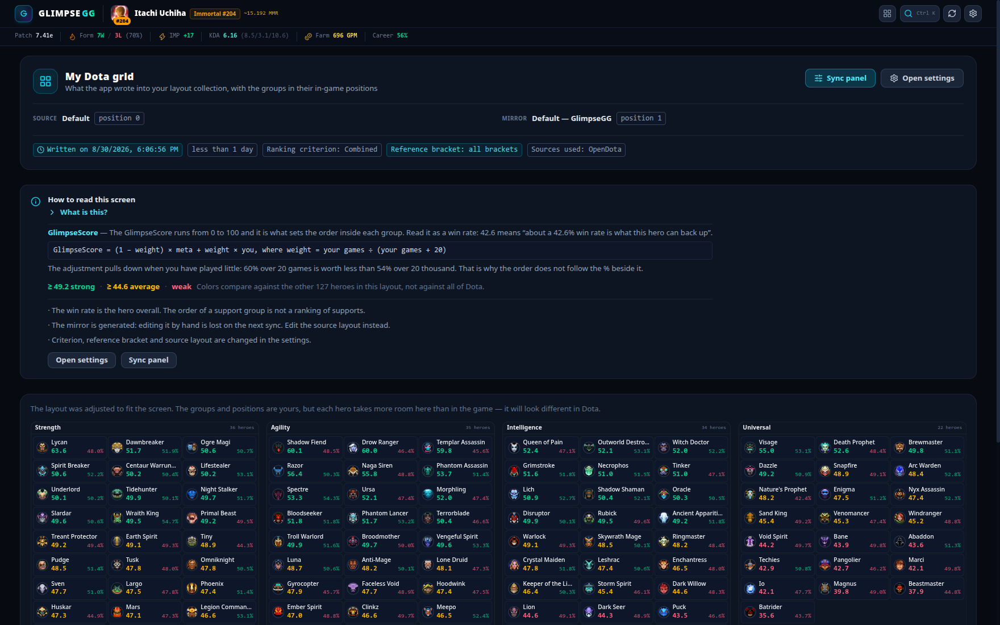
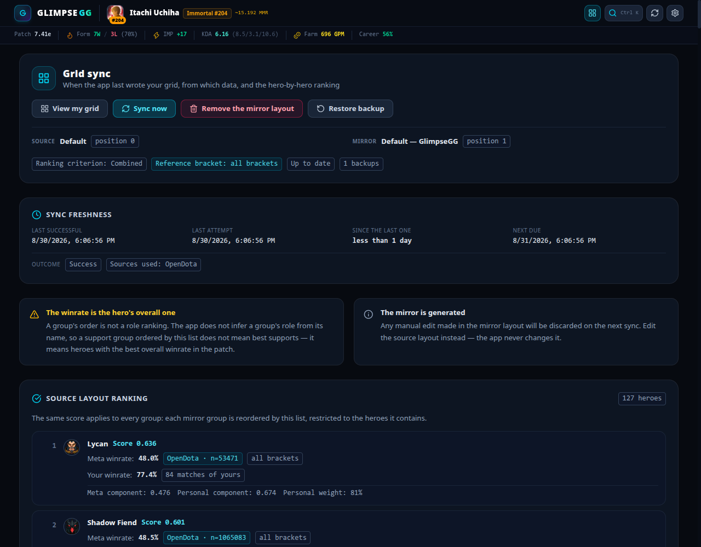
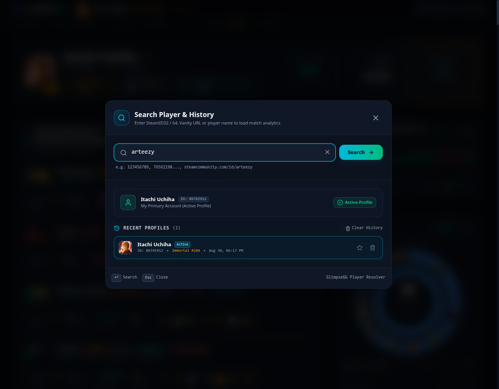
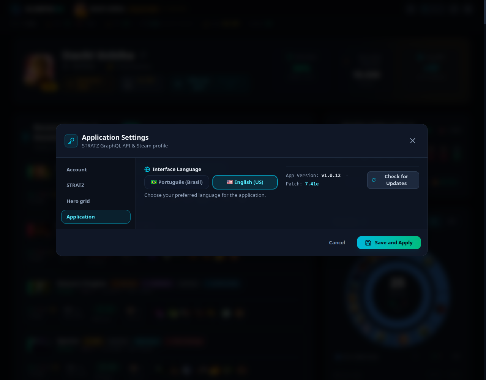

# GlimpseGG

**English** · [Português (pt-BR)](README.pt-BR.md)

Desktop app for Dota 2 post-game analysis. It cross-references STRATZ and OpenDota data to turn a
finished replay into a tactical read: per-hero and per-position benchmarks, advantage timeline,
vision map, and actionable per-player insights.

Built with Electron + React + TypeScript + Vite. The interface ships in Portuguese (pt-BR) and
English (en-US).

## Why it exists

GlimpseGG is not trying to be an alternative to STRATZ, nor to propose a new methodology. The goal
is narrower: **keep what STRATZ used to show up to date**.

STRATZ stopped receiving updates, and the cost shows up on every patch — new heroes and items never
make it into the datasets, so matches containing them are displayed incorrectly and fall out of any
analysis. It is not that the read gets worse: it simply does not happen for recent content.

GlimpseGG fills that gap. **The metrics are computed the same way STRATZ computed them** — the
intent is not to diverge from the numbers you already knew, but to keep producing them for the
current patch, with new heroes and items properly recognized, displayed and analyzed.

## Features

**Player dashboard**
- Profile, rank and recent form
- Match list with a per-game summary
- Most played heroes and performance trend
- Activity heatmap
- Teammate matrix and STRATZ trends

**Match analysis** — four tabs per player
- `OVERVIEW` — scoreboard, team overview, advantage timeline
- `PERFORMANCE` — metrics against the hero/position baseline
- `VISION` — real wards on the minimap, with lifetime, placer, dewards and coverage
- `COACHING` — deterministic diagnosis: comparison against the average for that hero in that
  position, build recommendation from the patch's win rate, and death forensics

**Hero grid mirror** — writes a copy of your in-game hero layout, reordered by win rate
- Your layout is never touched: the mirror is a **new entry** beside it, and the write aborts if
  anything else in the file changed
- Ordered by GlimpseScore, which blends the patch's meta win rate with your own history
- Works with no STRATZ token — OpenDota is the primary meta source

## Screens

The captures below come from the running app, with data from STRATZ and OpenDota. The profile shown
is a public high-rank account (`86745912`), used only to illustrate the screens — none of the
maintainer's data appears here. The hero grid screens use a **fictitious layout** grouped by the
four attributes, the way Dota ships it by default: a hero grid is a local file, so there is no such
thing as another player's grid to show.

**Player dashboard** — profile and rank, recent form, match list with a per-game summary, top heroes
and the trends coming from STRATZ.


**`OVERVIEW`** — match awards, team comparison, gold/XP advantage timeline and the scoreboard, with
the purchase order and timing of every item for the selected player.


**`PERFORMANCE`** — item timings against the benchmark target, skill radar, first-10-minute metrics,
damage breakdown and ability order.


**`VISION`** — real wards over the minimap, with vision radius, lifetime, placer, dewards and
coverage, navigable through the match timeline.


**`COACHING`** — deterministic diagnosis. Every card carries the number, its provenance (hero
average, patch data, this match) and the sample size.


**Hero grid — the mirror** — a replica of what the app wrote into your Dota layout collection, with
the groups in their in-game positions and the GlimpseScore that set the order inside each one.



**Hero grid — sync panel** — when the grid was last written, from which sources, and the
hero-by-hero ranking with the meta and personal components of every score.



**Player search** — look a player up by SteamID32/64, vanity URL or name, with history and
favourites. Opens with `Ctrl K`.



**Settings** — interface language, STRATZ token, active Steam account and the hero grid
configuration, split into four tabs.



**Onboarding** — the first run asks for the interface language (English by default) and the STRATZ
token. The Steam Account ID is detected automatically from the token itself.


## Requirements

- Node.js 24+
- npm 10+

## Installation

Download the binary for your platform from the [Releases](https://github.com/MarcosRosado/glimpsegg/releases)
page:

| Platform | Artifact |
| --- | --- |
| Windows | `GlimpseGG-Setup-<version>-x64.exe` (installer) or `GlimpseGG-Portable-<version>-x64.exe` |
| Linux | `GlimpseGG-<version>-linux-x86_64.AppImage` |
| macOS | `GlimpseGG-<version>-mac-<arch>.dmg` |

The app updates itself from this repository's Releases.

## STRATZ token

The match analysis **needs a token** — it is the only source for match details, and there is no
demo dataset to fall back on. The old one was removed on purpose: it opened the app on the wrong
match instead of saying that something had failed. Without a token the first run opens onboarding,
and the navbar keeps a **No Key** badge that takes you to Settings.

To use real data:

1. Generate a token at <https://stratz.com/api>.
2. Paste it into the first-run onboarding, or later under **Settings → STRATZ API Token**.
3. The Steam Account ID is extracted automatically from the token's own `SteamId` claim — there is
   nothing to type.

The hero grid mirror is the exception: it works end to end with no token, because its primary meta
source is OpenDota, which is public.

> [!WARNING]
> **A personal STRATZ token cannot be revoked.** If it leaks, it stays valid until the expiry date
> embedded in the JWT. Never commit the token, and never paste it into issues, pull requests or
> screenshots. It is a Bearer token: whoever holds the value spends your API quota.

## Privacy

**GlimpseGG has no server of its own.** There is no backend, no database and no service operated by
this project. Nothing you do in the app is sent to any infrastructure of ours, because none exists.

Practical consequences:

- **None of your data is stored on a server.** There is no sign-up, account, login or profile on the
  project's side.
- **No telemetry, no analytics.** The app collects no usage metrics, has no crash reporter and
  embeds no tracking SDK.
- **The STRATZ token never leaves your machine**, except in the `Authorization` header of the calls
  that go straight to STRATZ itself — the party that issued it.

The app is only a client: it talks directly to public third-party APIs to build the screens. For
transparency, everything it communicates with:

| Destination | What for | What is sent |
| --- | --- | --- |
| `api.stratz.com` | Match details, benchmarks, trends | Your token and the Steam Account ID being queried |
| `api.opendota.com` | Profiles, teammates, vanity URL lookup | The Steam Account ID or the search term |
| `cdn.cloudflare.steamstatic.com` | Hero and item icons (Valve) | Nothing beyond the image request |
| `avatars.steamstatic.com` | Player avatars (Valve) | Nothing beyond the image request |
| `www.opendota.com` | Rank icons | Nothing beyond the image request |
| `fonts.googleapis.com`, `fonts.gstatic.com` | Inter and JetBrains Mono fonts | Nothing beyond the font request |
| `github.com` | App update check | Nothing beyond the version being queried |

A Content-Security-Policy in the production bundle restricts connections to exactly that list —
any other destination is blocked by Chromium itself.

### Where the token is stored

In plain text, **locally**, unencrypted:

- **Desktop:** `stratz_app_config.json` inside Electron's `userData` directory
  (`~/.config/GlimpseGG` on Linux, `%APPDATA%\GlimpseGG` on Windows,
  `~/Library/Application Support/GlimpseGG` on macOS).
- **Browser (dev):** `localStorage`, key `stratz_api_key`.

The token is never embedded in the bundle or in the release artifacts. Treat the machine as the
trust boundary: any process with access to your user profile can read that file.

## Development

```bash
npm install
cp .env.example .env     # optional — the token can also be entered through the UI
npm run electron:dev     # Vite + Electron with HMR
```

Other scripts:

| Script | What it does |
| --- | --- |
| `npm run dev` | Vite only, in the browser (without the Electron APIs) |
| `npm run build` | Type-check (`tsc -b`) + production bundle |
| `npm run electron:start` | Electron over the already-compiled bundle |
| `npm run electron:test-clean` | Electron with an isolated `userData`, to test onboarding from scratch |
| `npm run icons:generate` | Rasterizes every icon from `build/icon.svg` |
| `npm run icons:check` | Checks that the icon binaries are in sync with the master |
| `npm test` | Unit tests (vitest) of the pure functions — runs in CI before the build |
| `npm run test:watch` | Same, in watch mode |
| `npm run dist` | Packages the Linux AppImage |
| `npm run dist:all` | Packages macOS + Windows + Linux |

Tests live in [`tests/`](tests/), mirroring the source tree — they are not co-located with the
code. `src/` and `electron/` hold only what the app ships.

### Visual identity

The brand art lives in two places, and **changing one requires reviewing the other**:

| File | Role |
| --- | --- |
| `build/icon.svg` | Master source of the app icon. Every PNG, the `.ico` and `public/favicon.svg` are **generated** from it — do not hand-edit the derivatives. |
| `src/components/brand/BrandMark.tsx` | In-app monogram (navbar, splash, onboarding). Hand-redrawn on a 24px grid, `currentColor`. |

After touching the master, run `npm run icons:generate` and **commit the binaries together with the
SVG**: CI does not regenerate icons, so a commit without them publishes a release with the old art
and no sign of an error. `npm run icons:check` runs in CI precisely to stop that.

Two constraints on the master, both enforced by a preflight in the generator:

- **No text elements** — the font fontconfig resolves varies per machine
  (`fc-match "JetBrains Mono"` returns Noto Sans here), so the same SVG would rasterize differently
  in each place. Letters go in as `<path>`.
- **ImageMagick with the `RSVG` delegate** — without librsvg, ImageMagick falls back to its internal
  `MSVG` renderer, which ignores gradients and filters and would produce a destroyed icon with no
  error.

### Data sources

- **STRATZ** (GraphQL, `api.stratz.com`) — match details, ward and death events, `heroAverage` (the
  hero's average for that position), and the `heroStats` aggregates (`itemFullPurchase`,
  `heroVsHeroMatchup`) that feed the build recommendation. Requires a token.
- **OpenDota** (REST, `api.opendota.com`) — profiles, teammates, vanity URL lookup. Public, no key.

No language model is involved anywhere. The coaching engine is deterministic: every number on screen
traces back to a specific field of the STRATZ response, and the card shows its provenance (hero
average, patch data, this match, or generic estimate) along with the sample size. When the replay
was not parsed by STRATZ, the corresponding analysis simply does not appear — nothing is estimated
to fill the gap.

### Third-party assets

- `public/minimap.png` — Dota 2 minimap (patch 7.41), taken from
  <https://liquipedia.net/dota2/Minimap>. It is Valve art, included here only to render ward
  placement. It is not covered by this repository's MIT license. The coordinate mapping was
  calibrated against this image: with STRATZ cells 64–192 stretched edge to edge, the river's two
  power runes land on water and 97% of a 544 real-ward sample lands on terrain.

## Releases

Every push to `main` bumps the patch version, creates the tag and publishes a release with the
artifacts for all three platforms, via GitHub Actions. The gates are `icons:check`, `npm test` and
`npm run build` — a red test blocks the release.

## Contact

Marcos Rosado — <contato@marcosrosado.dev>

Bugs and suggestions: open an [issue](https://github.com/MarcosRosado/glimpsegg/issues).
Never include your STRATZ token in issues, logs or screenshots.

## License

MIT — see [LICENSE](LICENSE).
